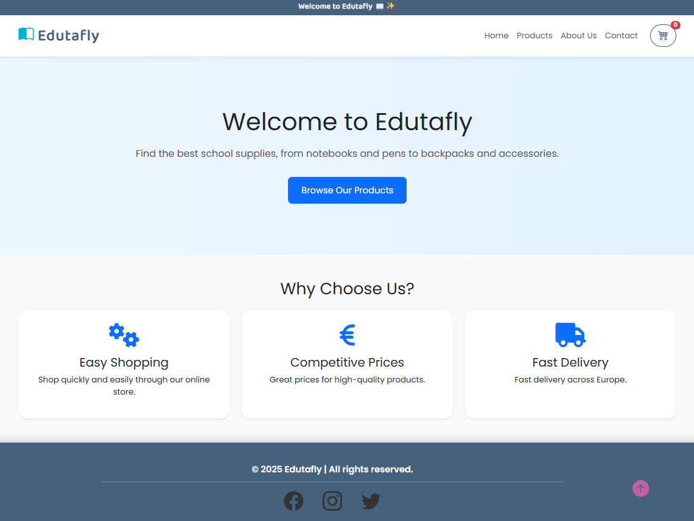
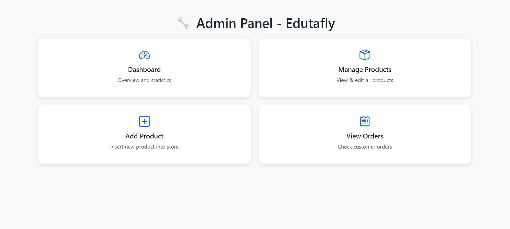

# Edutafly

**Edutafly** is a simple e-commerce web application that sells basic student supplies.  
The application allows users to browse products, add them to a shopping cart, and place orders — all without requiring user authentication.  
It also includes an admin panel for managing products and tracking customer orders.

---

## 🛠️ Technologies Used

- **PHP** – Backend logic
- **MySQL** – Database management
- **HTML / CSS (Bootstrap)** – Front-end design and responsiveness
- **JavaScript** – Cart functionality and dynamic updates
- **XAMPP** – Local development environment

---

## 🔍 Features

### 👤 User Side
- Browse a list of available student supplies
- View detailed product descriptions and images
- Add items to the shopping cart
- Update quantities or remove items
- Submit an order with name and email
- View confirmation page after placing an order

### 🛒 Admin Panel
- View all existing products
- Edit or delete products
- Add new products
- View all orders placed by users

---

## 🚀 Installation & Setup

1. **Clone or download** this repository:
https://github.com/aspasiax/eshop-Edutafly.git

2. **Move the folder** into your `htdocs` directory: C:\xampp\htdocs\Edutafly

3. **Start XAMPP**, then:
- Launch **Apache**
- Launch **MySQL**

4. **Import the database**:
- Open `phpMyAdmin` at `http://localhost/phpmyadmin`
- Create a new database named `edutafly`
- Import the `edutafly.sql` file from the project folder

5. **Update the database connection file if needed**:
- If you're using a different MySQL port (e.g., `3307`), modify `db.php` or use `db_local.php`

6. **Visit the application in your browser**: http://localhost/Edutafly/index.php
7. **Visit the admin panel in your browser**: http://localhost/Edutafly/admin_panel.php

---

## 📚 Project Info

- **Courses:**  
  - Client-Side Web Programming Language (JavaScript)  
  - Server-Side Web Programming Languages  

- **Institution:** IEK DELTA  
- **Department:** Computer Applications Technician (Multimedia / Web Designer - Developer / Video Games) 
- **Semester:** May 2025  
 

---

## 💬 Notes

- This application is intentionally simple and does not include user registration or login.
- It is designed for academic purposes only.

---
